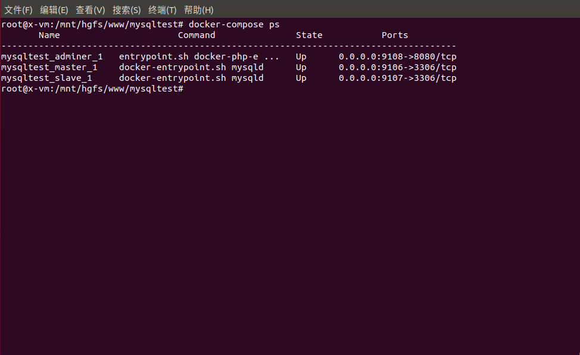
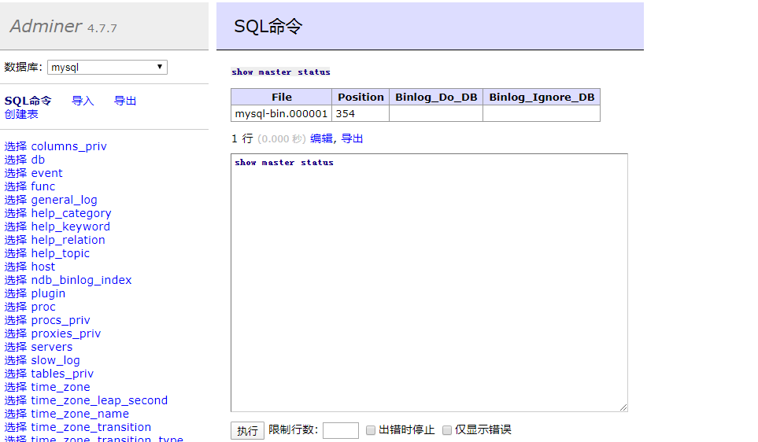

# mysql 主从复制试验
采用docker模拟多个服务器.

参考:https://www.cnblogs.com/songwenjie/p/9371422.html


## 导入mysql配置文件
```
之前权限无法修改原因是:我在虚拟机下的linux 共享目录到win10,整个项目 直接在linux中操作,就没问题.

// 设置下权限
chmod 644 $PWD/config/db/master/conf.d/mysqld.cnf
chmod 644 $PWD/config/db/slave/conf.d/mysqld.cnf
```



## 查看日志是否开启
```
show master status
```



## 在从数据操作
```
// master_log_file master_log_pos 主库 show master status 中的两个字段
// host 可以直接用容器名
change master to master_host='master', master_user='root', master_password='root', master_port=3306, master_log_file='mysql-bin.000004', master_log_pos= 747, master_connect_retry=30;

start slave //开启主从同步
show slave status // 查看主从同步状态
```

## 最后测试
测试结果和预料的一样.